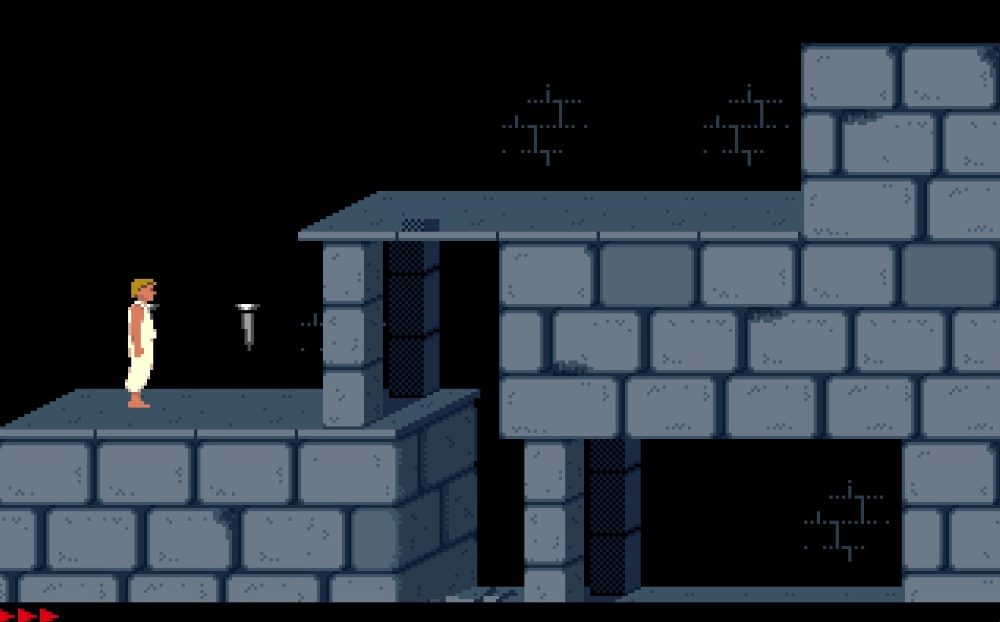

# Prince of Persia

A faithful port of Jordan Mechner's 1989 *Prince of Persia* to **Swift 6** and
**SpriteKit**, for macOS.

The **source code is MIT** — take it. The **game's artwork, music and sound effects are
Ubisoft's** and are here for preservation and study only; see [`ASSETS.md`](ASSETS.md).



---

## What this is

The guiding idea is one sentence: **port the *game* exactly; rewrite the *engine*
completely.**

Prince of Persia is not a platformer with a physics engine. It is a **virtual
machine**: an actor runs a sequence of opcodes until one of them emits a frame,
and one tick is exactly one frame. Every animation is the state machine — a strike
is only legal on six specific frame numbers, and pressing the key on any other
frame does nothing at all. That is why the game feels deliberate rather than
mashable, and it is the single most important thing to preserve.

So the simulation is transcribed from the reference rather than re-derived, down to
the numbers that look like mistakes. It is headless, deterministic from a seed, and
covered by a few hundred tests that run in half a second.

---

## Quick start

Clone and double-click:

```bash
open "build/Prince of Persia.app"
```

Or build and run it yourself:

```bash
cd PrinceOfPersia
swift run Prince
```

Requires macOS 26 and a Swift 6.2 toolchain. There are no dependencies.

To rebuild the `.app` after changing something:

```bash
./Scripts/make-app.sh
```

---

## Controls

### Movement and action

| Key | Does |
|---|---|
| **←** → | Walk, run, turn |
| **↑** | Jump — or climb up a ledge you are hanging from |
| **↓** | Crouch — or lower yourself over an edge |
| **Shift** | The action key |

Shift does everything that is not walking: **pick up** a sword, **drink** a potion,
**strike** with your sword, **grab** a ledge while falling, **hold on** to a ledge,
and **climb the stairs** at an exit. It is a modifier rather than a letter key,
which is why it is read from the modifier state and why you can rebind it.

### When you die

The Prince dies a lot, and the game says so and then gives you the level back:

| | |
|---|---|
| **Any key** | Restart the level from the top |
| *(or wait)* | It restarts itself after about twenty seconds |

**"Press Button to Continue"** appears in the status bar four seconds after the death animation,
flashes for the last stretch, and beeps each time it flashes back on. Pressing a key before the
message appears still works — the countdown has already started.

It is a **press**, not a hold. If you died while running right then you are still holding right,
and that does not count: let go and press again.

A restart is a full reload — full health, the boards whole, the gates shut, every guard back
where the level put him. That is the run starting over, which is not the same as reaching a new
level: finishing one carries your health forward.

### Resuming where you left off

**Quit and come back, and you start on the level you were on.** It is loaded from the top —
full health, a fresh hourglass, the level as the designer built it — which is the same thing
dying does. Nothing about a half-finished level is kept.

| | |
|---|---|
| **⌘ N** | New Game — forget the save and start at level 1 |
| `--new-game` | The same thing from the command line |
| `--level N` | Start on a specific level, whatever the save says |

The save is a single number:

```
~/Library/Application Support/PrinceOfPersia/progress.json
```

Delete it to start over. It is ignored if it is missing, unreadable, or names a level that does
not exist — the game will not refuse to start because of a bad save file.

### The window size is remembered too

**Pick a scale from the View menu and the next launch opens at it.** It is written to
`window.json` next to the save, and it is clamped to whatever the current display can hold — a
scale chosen on a big screen opens smaller on a laptop rather than hanging off the bottom.

`--scale N` is an override for that one launch, not a new setting, so a screenshot command cannot
quietly change what you chose. Deleting `window.json` puts the default 2× back.

> **This is an addition, not a port.** Neither the 1989 original nor PrinceJS saves anything:
> `Boot.js` hardcodes level 1, and the game was designed to be played in one sitting against a
> sixty-minute hourglass. Resuming is a modern convenience bolted onto a 1989 game, and it is
> the one place this port knowingly departs from the original. `--new-game` is there for anyone
> who would rather have it as it was.
Note the two sequences you will press by accident:

* **↑ + ←/→** is a standing jump; **↑ alone** jumps straight up, and becomes
  a high jump when there is room above him.
* **Shift alone** reaches for whatever is in front of you — a sword, a potion, a
  ledge above. **Shift while falling** catches a ledge, and there is a window of only
  a few frames in which that works, so it has to be pressed early.

### Window size

The game always simulates at its original **320 × 200** pixels, and the window is an
integer multiple of that. Change it at any time; nothing about the game changes.

| Shortcut | Window | | Shortcut | Window |
|---|---|---|---|---|
| **⌘ 1** | 320 × 200 | | **⌘ 5** | 1600 × 1000 |
| **⌘ 2** | 640 × 400 *(default)* | | **⌘ 6** | 1920 × 1200 |
| **⌘ 3** | 960 × 600 | | **⌘ 7** | 2240 × 1400 |
| **⌘ 4** | 1280 × 800 | | **⌘ 8** | 2560 × 1600 |

The **View** menu lists only the sizes that fit your display, so on a laptop the
higher entries may be missing. Sizes are capped to the screen rather than offered
and then rejected. Integer multiples only: a fractional scale would land the
32 × 63 tile grid on non-integer pixels and the art would shimmer.

### Menus

| Shortcut | Does |
|---|---|
| **⌘ N** | New Game — start over from level 1 |
| **⌘ R** | Restart the current level |
| **⌘ W** | Close the window — which **quits the game**, since there is only one |
| **⌘ M** | Minimise |
| **⌘ K** | Open your key bindings in the default editor |
| **⌘ Q** | Quit |
| **⌘ H** | Hide |

There is one window and no document, so closing it means you are done: the app terminates rather
than sitting in the Dock doing nothing. The **Options** menu also has **Reset Key Bindings to
Default**.

### Rebinding the keys

Key bindings live in a file, not in a dialog:

```
~/Library/Application Support/PrinceOfPersia/keys.json
```

It is written with the defaults the first time the game launches. **⌘ K** opens it.
Edit and relaunch. The values are macOS virtual key codes, which you can read off
with `hidutil` or find in `Carbon.HIToolbox`'s `kVK_*` constants.

```json
{
  "action" : 56,
  "down" : 125,
  "left" : 123,
  "right" : 124,
  "shiftIsAction" : true,
  "up" : 126
}
```

| Field | Default | Meaning |
|---|---|---|
| `left` `right` `up` `down` | 123 124 126 125 | The arrow keys |
| `action` | 56 | Left Shift |
| `shiftIsAction` | `true` | Whether the Shift *modifier* also counts as the action key |

`shiftIsAction` is the one that needs explaining. Shift never arrives as a key-down
in a window's event monitor, so it is read from the modifier flags instead — and it
stays correct when you tab away and back. If you would rather put the action on a
letter, set `action` to that key's code and `shiftIsAction` to `false`.

A garbled or missing file is ignored and the defaults are used. The game will not
refuse to start because of a typo.

---

## Command line

The same binary takes flags, which is useful for screenshots, for the trace, and
for jumping straight to a room:

```bash
swift run Prince                              # the game
swift run Prince --scale 4                    # 1280 x 800
swift run Prince --level 3 --room 16          # start in the chopper room
swift run Prince --no-audio                   # silent
```

| Flag | Does |
|---|---|
| `--scale N` | Window scale, 1–8, capped to the display, for this launch only |
| `--level N` | Start on level 1–14, whatever the save says |
| `--new-game` | Forget the save and start at level 1 |
| `--room N` | Start in a specific room |
| `--location N` | Start at a specific tile (`y * 10 + x`) |
| `--seed N` | Seed the RNG, so a run is reproducible |
| `--volume F` | 0–1 |
| `--mute`, `--no-music`, `--no-audio` | Silence, one channel at a time |

Diagnostics:

| Flag | Does |
|---|---|
| `--trace --ticks N` | Print the simulation tick by tick, with sounds and music |
| `--hold left,up` | Hold inputs for the run, for reproducible screenshots |
| `--screenshot out.png` | Render one frame headlessly and exit |
| `--dump-frame FRAME --atlas SHEET` | Render a single atlas frame at 1:1 |

```bash
# Walk right for two hundred ticks and list every sound the game made.
swift run Prince --trace --level 1 --hold right --ticks 200 | grep 'sound:'

# A frame with the spikes up, without opening a window.
swift run Prince --level 1 --room 6 --location 1 --hold right --ticks 16 \
    --screenshot spikes.png
```

---

## What is in it

Everything that made the original game:

* **The sequence VM** — all 256 opcodes, and the per-actor-class dispatch that
  makes an opcode a silent no-op for an actor that never registered it.
* **The Prince** — walking, running, turning, crouching, crawling, jumping,
  hanging from ledges, climbing, and the swing-to-momentum drop.
* **Combat** — sword fighting with the original frame-by-frame gates, and the
  guard AI with its twelve probability tables transcribed verbatim.
* **Every hazard** — collapsing floors, spikes, slicer blades, potions, the sword,
  gates, floor buttons, the exit door.
* **The hourglass** — sixty real minutes, and the run ends when it empties.
* **The sound** — all 33 effects and the eight music tracks the original loads.
* **All fourteen levels**, chained: finish one and the next loads with your health.

### What is not

* **Cutscenes.** The title screen, the prologue and the ending are not ported.
* **The shadow overlay** on levels 5 and 6, which needs a mirror-merge effect.

Nothing is *simplified*. Where the original does something odd, this does the same
odd thing, and `ARCHITECTURE.md` records why.

---

## Testing

```bash
cd PrinceOfPersia
swift test
```

339 tests, about half a second. They are all headless — no window, no audio device
— because the simulation is a pure value type and never touches either. That is the
whole reason the port is structured the way it is, and it is what kept the work
checkable.

The tests are not just coverage. Several of them exist because a test *falsified*
something that had been assumed: that events are indexed by position rather than by
label, that a button's modifier is an array index, that a falling actor only dies at
`fallingBlocks === 2`, that `Phaser.Rectangle.intersects` counts edge-touching as
overlapping. Those are all in `ARCHITECTURE.md`.

---

## Layout

```
PrinceOfPersia/
  Sources/PoPCore/     the faithful port. No Apple UI framework, ever.
  Sources/PoPHost/     the Swift 6 rewrite: rendering, input, audio, flow.
  Sources/Prince/      the executable, and its command-line flags.
  Tests/               the headless test suite

Scripts/make-app.sh    assembles Prince of Persia.app

README.md              this file
ARCHITECTURE.md        the design, the laws, and every decision with its reason
PROMPT.md              the milestone board and what is still open
LICENSE                MIT, for the source code
ASSETS.md              the game's artwork, music and levels — Ubisoft's, and why they are here
```

The split is enforced, not merely intended. `PoPCore` may not import SpriteKit,
AppKit, GameplayKit or AVFoundation, and there is a one-line check for it:

```bash
grep -rE 'import (SpriteKit|AppKit|GameplayKit|AVFoundation)' \
    PrinceOfPersia/Sources/PoPCore/ && echo VIOLATED || echo 'core is clean'
```

---

---

## Troubleshooting

### The app shows a generic icon, or the previous one

Nothing is wrong with the bundle. `Scripts/make-app.sh` deletes the app and recreates it at the
same path with the same bundle identifier, and **the Finder and LaunchServices key their icon
caches on exactly that identity** — so a rebuild keeps showing the old icon, or none at all,
while the file on disk is perfectly correct.

The script re-registers the bundle with LaunchServices on every build, which handles the Finder.
If the **Dock** is still stale it is holding its own copy:

```bash
./Scripts/make-app.sh      # already re-registers; try this first
killall Dock               # the Dock keeps a separate cache
```

To confirm the bundle itself is fine:

```bash
ls "build/Prince of Persia.app/Contents/Resources/AppIcon.icns"
iconutil -c iconset "build/Prince of Persia.app/Contents/Resources/AppIcon.icns" -o /tmp/i.iconset
ls /tmp/i.iconset          # ten images, 16x16 through 512x512@2x
```

## Licensing

**Two different things live in this repository, and they have two different owners.**

| | Licence |
|---|---|
| The **Swift source** — everything under `PrinceOfPersia/` and `Scripts/` | **MIT.** Yours to take. |
| The **game's assets** — artwork, music, sound effects, level data | **Ubisoft's.** Not the author's to license. |

The full text is in [`LICENSE`](LICENSE), and [`ASSETS.md`](ASSETS.md) covers the assets: what
they are, where they came from, and the position on them. The short version of the second one:

This is a **port**, written from publicly available reimplementations rather than from any
original source. It contains no code from the 1989 game. The game design, artwork, music and
sound effects belong to **Ubisoft**, and they ship here because a port of a game is meaningless
without the game. This is a **preservation and study project**: it is not a product, it is not
for sale, and **no rights in Prince of Persia are granted or claimed anywhere in it**. If you
are Ubisoft and you would like it taken down, open an issue and it will be — no argument, no
delay.

**This repository is public**, which is worth stating plainly given the above: the assets are
publicly visible here, and so is the compiled `.app` that embeds them.

The Swift source is the author's own work. Three reference implementations were read while
writing it, and `ARCHITECTURE.md` §2 records exactly what each one contributed — none of their
code is present in this repository, and nothing was transcribed from the GPL one:

* **PrinceJS** — the port source, and where the assets came from. The Unlicense.
* **SDLPoP** — read as a behavioural oracle only, never transcribed. GPLv3.
* **Mechner's Apple II source** — historical reference, not a port source.

---

Made with ♥️ by DeepSeek
